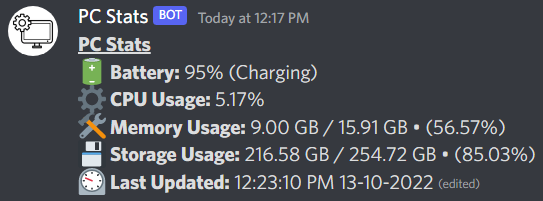

# PC STAT BOT
### A self hosted Discord bot to display your pc stats.


<br>



# Features
- ### Displays stats like CPU Usage, Memory, Storage and Battery
- ### View or share your PC stats with anyone on Discord
- ### Easy to get started
- ### One of a kind
- ### Modular design


# Installation
Download the repo as a zip and extract it to a folder. Open a command prompt in that folder and and then run the command `npm install` or `yarn install` (needs [Node.js](https://nodejs.org/)).
- Rename the file `config_example.json` to `config.json`.
- Goto [Discord Developer Page](https://discord.com/developers/applications) and make a new application.
- Give it any name.
- Then go to the OAuth2 tab and copy the ClientID and paste it in the `config.json` file 
- Copy the token value from the Bot tab and paste it in the `config.json` file 
- In the same Bot tab, scroll down and make sure that the 'Message Content' priviledged intent is enabled. 


# Usage
Either run `start.cmd` or open a terminal and run `node server.js`
<br>
For the first run, click on the invite link in the terminal and add the bot to whichever server you want, then goto any channel in that server where you want the stats and type `s.start`

## Commands
- `s.help` - Shows a help message
- `s.ping` - Check API latency
- `s.start` - Start the bot (run this only the first time)
- `s.stop` - Stop the bot


## config.json
This is the configuration file used by the program.

| Key              | Type                       | Value                                                                                                    |
| ---------------- | -------------------------- | -------------------------------------------------------------------------------------------------------- |
| token            | string                     | The token of the bot from Discord Developer Page                                                         |
| clientID         | string                     | The client ID of the bot from Discord Developer Page                                                     |
| interval         | integer                    | The time in seconds to wait before updating the stats each time                                          |
| title            | string                     | Will be displayed in the first row of the Bot message                                                    |
| displayActivity  | boolean          \| string | Whether to show a presence for the bot. If it is a string, thent the presence will be set to that value. |
| displayTimestamp | boolean\|string            | Which timestamp format should be displayed. One of true, false, '24h' or '12h'                           |
| components       | object                     | An object with key as component name and value as enabled status                                         |

## Available Components

| Name         | Description                                  |
| ------------ | -------------------------------------------- |
| battery      | Shows battery percentage and charging status |
| memoryUsage  | Shows used memory and total memory           |
| cpuUsage     | Shows CPU usage percentage                   |
| storageUsage | Shows used storage and total storage         |

## Example config.json
```json
{
    "token": "token from bot section of discord developer page",
    "clientID": "client id from oauth2 section of discord developer page",
    "interval": 30,
    "title": "pc-statbot",
    "displayActivity": "Stats for Delano's PC. See s.help",
    "displayTimestamp": true,
    "components": {
      "battery": true,
      "cpuUsage": true,
      "memoryUsage": true,
      "storageUsage": true
    }
  }
```

## Bugs / Suggestions
Report any bugs / glitches, or make a suggestion using the github issues section or join the support server [Join Server](https://discord.gg/FZY9TqW).

## Other bots
Check out my other bots
- [Delano Tatusmi](https://delano-tatsumi.herokuapp.com)
- [House Builder](https://house-builder.herokuapp.com)

## Support
Join the Discord Server: [3ddelano Cafe](https://discord.gg/FZY9TqW)
<br>
Support the creator
<br>
<a href="https://www.buymeacoffee.com/3ddelano" target="_blank"></a>

## Contributors
- [LukasL28](https://github.com/LukasL28)
